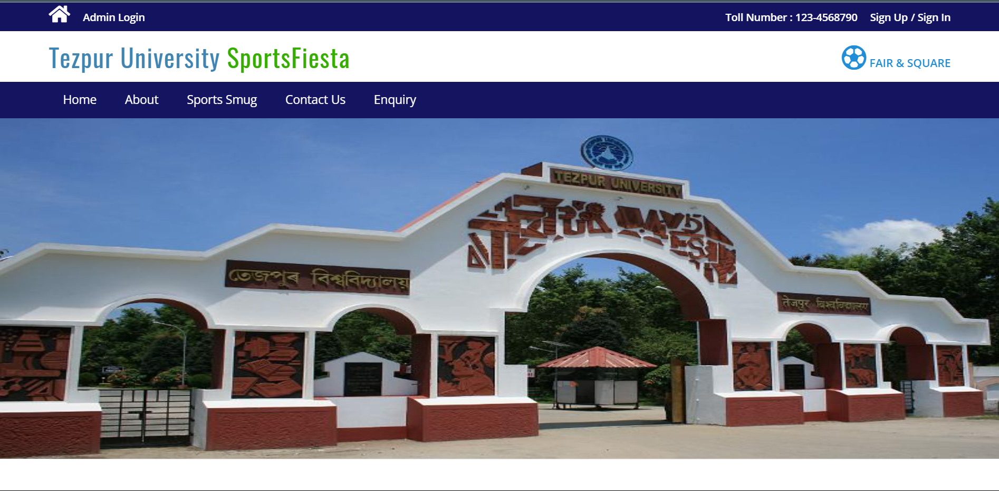
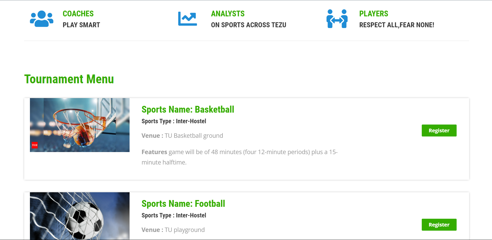
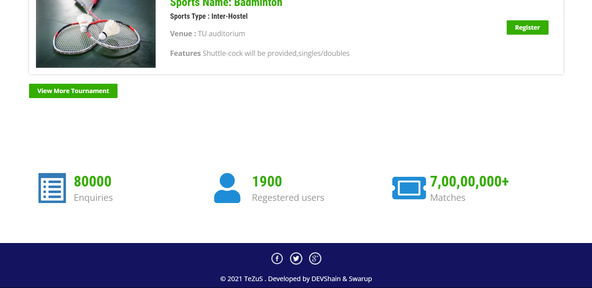

# Tournament-Management-System ---- TeZuS

The main goal of the application is to maintain the records of Student details with database maintenance. Tournament Management software is very needy for future purposes in Educational Institutes, This software helps them maintain day-to-day transactions on computers.

We have used PHP as a server-side language and MySQL for storing the database, HTML and CSS for Structure and Designing of the website and JavaScript for Validations.

Co-Developer- Swarup Seal

#***Software Preview***

